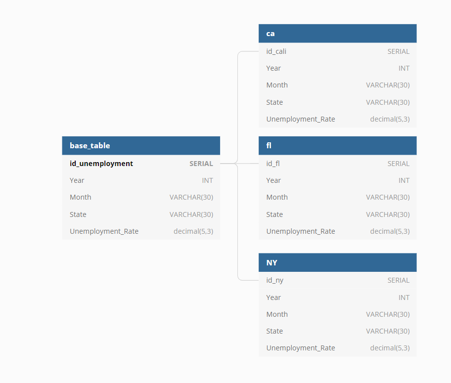

# ETL-Project
ETL-Project: June Unemployement in CA, FL &amp; NY

The purpose of this project was to review the unemployment rates across 3 States:

* California
* Florida
* New York

so further analyses could be done in the future on the potential impact from COVID-19 and the associated effects of unemployment itself.

Data for this project was acquired from CSVs from 3 State Labor Agencies:

CA Source: https://www.labormarketinfo.edd.ca.gov/data/unemployment-and-labor-force.html
FL Source: https://floridajobs.org/news-center/DEO-Press/2020/07/17/the-florida-department-of-economic-opportunity-announces-florida-s-unemployment-rate-for-june-2020#:~:text=The%20Florida%20Department%20of%20Economic%20Opportunity%20Announces%20Florida's%20Unemployment%20Rate%20for%20June%202020,-Jul%2017%2C%202020&text=TALLAHASSEE%2C%20Fla.,unemployment%20rate%20of%2013.7%20percent
NY Source: https://www.labor.ny.gov/stats/LSLAUS.shtm

Data was initially cleaned in pandas and further checked in excel. Process involved first removing NaN values, then columns were renamed and indexes were reset. In some cases State, Year and/ or Month columns were added to keep information categories uniform across states. Dataframes were concatenated so that further study could be run more easily on the combined dataset. Individual State data can include unemployment rate info for county, city, state and/ or national; please see description for details. Map on this website includes an ERD to show how individual State datasets are related to the full dataset

